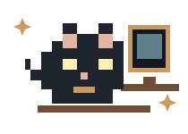

  
  <h1>ARIELLYA PUTRI SAYOW</h1>
  
<code>UI/UX · FRONTEND</code>

  
Designing clear interfaces, building useful ideas, and exploring interactive experiences.

---

## ◉ Statistics

  

---

## ◉ About Me

<table>
  <tr>
    <td width="150" align="center" valign="top"></td>
    <td valign="top">
      <strong>Hi, I’m Ariellya 👋</strong>  
      I’m an Informatics student interested in UI/UX and frontend development. I enjoy combining design, technology, and visual storytelling to create experiences that are clear, useful, and enjoyable to use.  
      <em>Make it clear, make it useful, then make it memorable.</em>
    </td>
    <td width="145" align="center" valign="top"></td>
  </tr>
</table>

---

## ◉ What I’m Exploring

<table>
  <tr>
    <td valign="top">
      <ul>
        <li>UI/UX design and user research</li>
        <li>Frontend and web development</li>
        <li>Interactive games and digital media</li>
        <li>Drawing and visual design</li>
      </ul>
    </td>
    <td width="185" align="center" valign="middle">
       
      my tiny coding companion
    </td>
  </tr>
</table>

---

## ◉ Tools & Technologies

  
    
  

---

## ◉ Let’s Connect

  
  
  

