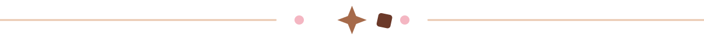

<div align="center">
  

  <a href="https://github.com/ariellyasayow?tab=followers">
    
  </a>
  
</div>

<br />

## 🍫 A little about me

```text
☕ currently brewing  : ideas, code, and a tiny bit of courage
🍓 aesthetic          : brownie, pastel, cream, and soft pink
✨ motto              : make it cute, then make it work
```

<div align="center">
  
  
</div>

## 🧁 My tiny tool shelf

<div align="center">
  
</div>

## 💌 Say hello

<div align="center">
  <a href="https://www.instagram.com/ariellya_ariel/">
    
  </a>
  <a href="mailto:sayowariellya@gmail.com">
    
  </a>
  <a href="https://ariellya.vercel.app/">
    
  </a>
  <br />
  <br />
  <a href="https://github.com/ariellyasayow">
    
  </a>
</div>

<br />

<div align="center">
  
  <sub>made with brownies, pastel dreams &amp; a sprinkle of code ♡</sub>
</div>
