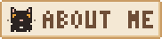
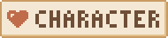
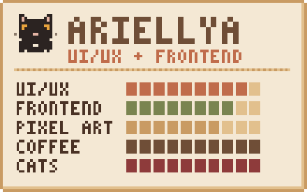
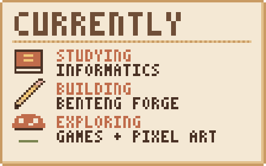
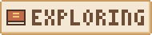
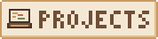
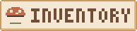
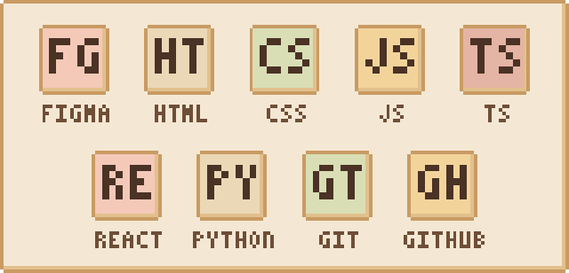
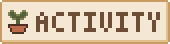
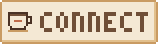

  
  <h1>ARIELLYA PUTRI SAYOW</h1>
  
<code>UI/UX · FRONTEND</code>

  

   
  
    

<table>
  <tr>
    <td width="150" align="center" valign="middle"></td>
    <td valign="middle">
      <strong>Hi, I’m Ariellya 👋</strong>  
      I’m an Informatics student interested in UI/UX and frontend development. I enjoy combining design, technology, and visual storytelling to create experiences that are clear, useful, and enjoyable to use.
    </td>
    <td width="210" align="center" valign="middle">
       
      my tiny coding companion
    </td>
  </tr>
</table>

  
<b>🐾 psst… click to pet the cat</b>

   
  

     
    <i>purrrrr… thank you for visiting ♥</i>
  

   
  
    
  
  
    

   
  
    

<table>
  <tr>
    <td width="72" align="center"></td>
    <td valign="middle"><b>UI/UX design</b> &amp; user research</td>
    <td width="72" align="center"></td>
    <td valign="middle"><b>Frontend</b> &amp; web development</td>
  </tr>
  <tr>
    <td width="72" align="center"></td>
    <td valign="middle"><b>Interactive games</b> &amp; digital media</td>
    <td width="72" align="center"></td>
    <td valign="middle"><b>Drawing</b> &amp; visual design</td>
  </tr>
</table>

   
  
    

<table>
  <tr>
    <td width="72" align="center"></td>
    <td valign="middle">
      <strong><a href="https://github.com/ariellyasayow/benteng-forge">Benteng Forge</a></strong> 
      A visual map editor for Bentengan Squad Tag — craft arenas, place props, and shape gameplay.
    </td>
  </tr>
  <tr>
    <td width="72" align="center"></td>
    <td valign="middle">
      <strong><a href="https://github.com/ariellyasayow/Survivor-Arena">Survivor Arena</a></strong> · <a href="https://survivor-arena-nu.vercel.app">play the demo</a> 
      An interactive browser game built with JavaScript.
    </td>
  </tr>
  <tr>
    <td width="72" align="center"></td>
    <td valign="middle">
      <strong><a href="https://github.com/ariellyasayow/Portofolio-Web">Portfolio Web</a></strong> · <a href="https://portofolio-web-seven-drab.vercel.app">live demo</a> 
      My personal portfolio website, showcasing design and frontend work.
    </td>
  </tr>
  <tr>
    <td width="72" align="center"></td>
    <td valign="middle">
      <strong><a href="https://github.com/ariellyasayow/Klinik-Sentosa">Klinik Sentosa</a></strong> 
      A clinic management interface built with TypeScript.
    </td>
  </tr>
</table>

  more in <a href="https://github.com/ariellyasayow?tab=repositories">my repositories</a> ♥
    
  
    
  
    
  
    
  <picture>
    <source media="(prefers-color-scheme: dark)" srcset="https://raw.githubusercontent.com/ariellyasayow/ariellyasayow/output/github-snake-dark.svg" />
    <source media="(prefers-color-scheme: light)" srcset="https://raw.githubusercontent.com/ariellyasayow/ariellyasayow/output/github-snake.svg" />
    
  </picture>
    
  
    
  <table>
    <tr>
      <td align="center" width="110"> portfolio</td>
      <td align="center" width="110"> projects</td>
      <td align="center" width="110"> instagram</td>
      <td align="center" width="110"> say hello</td>
    </tr>
  </table>
   
   
  shh… the cat is sleeping. made with ♥ and a lot of coffee

